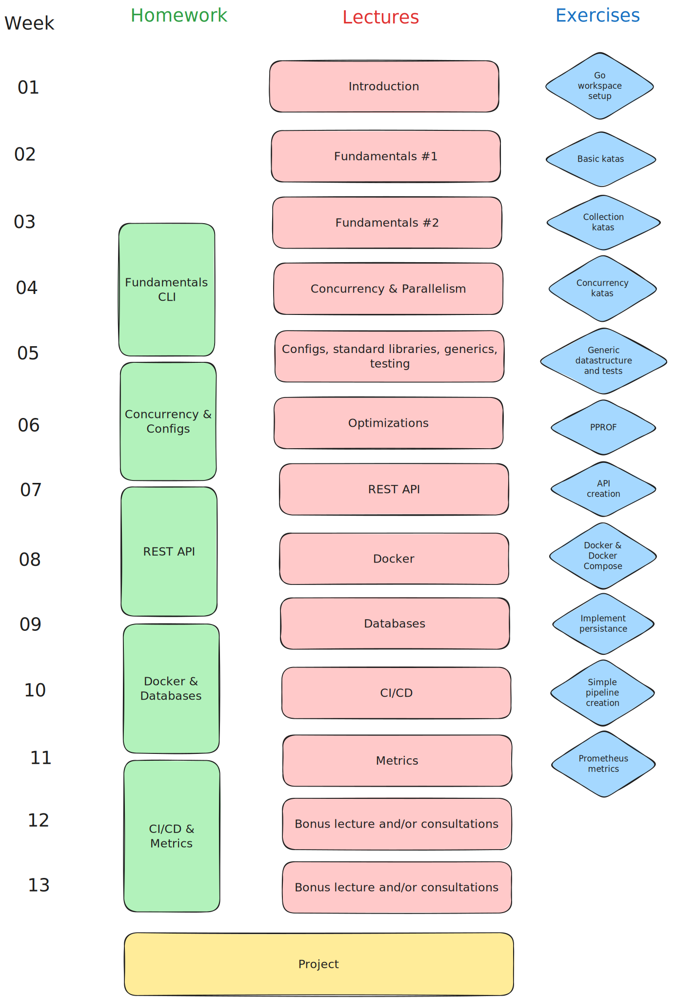

# Course Go

> [!WARNING]
> The course is currently a WIP! \
> None of the things stated here are final.

## Schedule

## Details

To learn more about the specific content of the course, visit the specific repositories:
- [Lectures](https://github.com/course-go/lectures)
- [Exercises](https://github.com/course-go/exercises)
- [Homework](https://github.com/course-go/homework)

## Thesis

The course was developed under a bachelor's thesis. You can check out [the thesis](https://github.com/stanislav-zeman/course-go-thesis) to learn more about the original design, reasonings and decisions made.

## Resources

This sections is a summary of guides, books, Go oriented courses or courses that are somehow related to the topics covered by this course and other resources. 

### Official resources

- [Go Wiki](https://go.dev/wiki/)
    - [Getting started with Go](https://go.dev/wiki/#getting-started-with-go)
- [Go Language Specification](https://go.dev/ref/spec)
- [Go User Manual](https://go.dev/doc)
    - [Frequently Asked Questions](https://go.dev/doc/faq)
- [A Tour of Go](https://go.dev/tour)

### Courses

- [Redhat Go Course](https://github.com/RedHatOfficial/GoCourse)
- [Learn Go](https://github.com/karanpratapsingh/learn-go)
- Three Dots Labs
    - [Learn Go in One Evening](https://threedots.tech/go-in-one-evening)
    - [Event Driven Go](https://threedots.tech/event-driven/)

#### University Courses
- [Go Programming Language - University of Zagreb](https://www.fer.unizg.hr/en/course/gpl#)
- [Go Programming - University of Pennsylvania (CIS 1903 Go Programming)](https://catalog.upenn.edu/courses/cis/)

### Online

 - [Udemy](https://www.udemy.com/topic/go-programming-language/)
    - [Go: Complete Guide](https://www.udemy.com/course/go-the-complete-developers-guide/)
    - [Backend Master Class](https://www.udemy.com/course/backend-master-class-golang-postgresql-kubernetes/)
    - [Docker & Kubernetes](https://www.udemy.com/course/docker-kubernetes-the-practical-guide/?kw=docker+%26+kuber&src=sac)
    - [GitHub Actions](https://www.udemy.com/course/github-actions-the-complete-guide/)
 - [Corsera](https://www.coursera.org/specializations/google-golang)
 - [Boot.dev](https://www.boot.dev/tracks/backend)

### Books

- Manning Publications
    - [100 Go Mistakes and How to Avoid Them](https://www.manning.com/books/100-go-mistakes-and-how-to-avoid-them)
    - [Shipping Go](https://www.manning.com/books/shipping-go)
- O'Reilly
    - [Learning Go](https://www.oreilly.com/library/view/learning-go-2nd/9781098139285)
    - [Head First Go](https://www.oreilly.com/library/view/head-first-go/9781491969540)
- Alex Edwards
    - [Let's go](https://lets-go.alexedwards.net)
    - [Let's go further](https://lets-go-further.alexedwards.net)
- Packt
    - [Mastering Go](https://www.packtpub.com/product/mastering-go-third-edition/9781801079310)
    - [Domain-Driven Design with Golang](https://www.packtpub.com/product/domain-driven-design-with-golang/9781804613450)
    - [Microservices with Go](https://www.packtpub.com/product/microservices-with-go/9781804617007)
    - [Test-Driven Development in Go](https://www.packtpub.com/product/test-driven-development-in-go/9781803247878)
- Bitfield Consulting
    - [For the Love of Go](https://bitfieldconsulting.com/books/love)
    - [The Power of Go: Tools](https://bitfieldconsulting.com/books/tools)
    - [The Power of Go: Tests](https://bitfieldconsulting.com/books/tests)
    - [Know Go: Generics](https://bitfieldconsulting.com/books/generics)
    - [Explore Go: Cryptography](https://bitfieldconsulting.com/books/crypto)

### Blogs & Articles

- [Bitfield Consulting](https://bitfieldconsulting.com/golang)
- [Yourbasic - KTH](https://yourbasic.org)
- [50 Shades of Go](https://golang50shad.es)
- [Three Dots Labs](https://threedots.tech)

### Examples & Exercises

- [Gopherlings](https://github.com/soypat/gopherlings)
- [Learn Go](https://github.com/inancgumus/learngo)
- [Learn Go with Tests](https://quii.gitbook.io/learn-go-with-tests/)
    - [GitHub](https://github.com/quii/learn-go-with-tests)
- [Go Crash Course](https://github.com/gabrieldim/Go-Crash-Course)
- [Go by Example](https://gobyexample.com)
- [Modern Go Application example](https://github.com/sagikazarmark/modern-go-application)

### Google Cloud Platform

- [GCP for Faculty](https://cloud.google.com/edu/faculty?hl=en)
